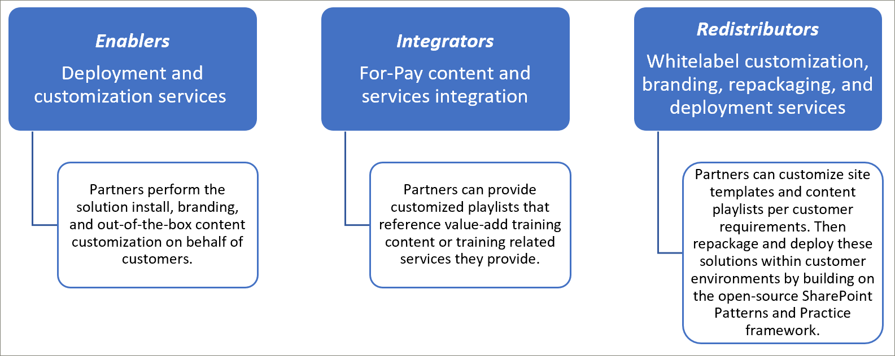

# パートナー統合モデル
SharePoint Online プロビジョニング サービスから Microsoft 365 ラーニング パス のコンテンツを直接 「箱から」補完することはできませんが、パートナーが利用できる統合モデルは複数あります。 上記のパートナー統合モデルは、昇順の複雑さおよび投資レベルの順に示されています。 したがって、当社のガイダンスは、ビジネス モデルに基づいて専門知識を構築し、より高度なレベルを卒業する方法です。

 

## どのように開始する必要がありますか? 
開始するには、以下のベスト プラクティスを示します。     

### 1. まず、Enabler としての専門知識を構築します。 
顧客ベースの割合は、学習経路のトレーニング ポータルを有効にし、対象となる Microsoft コンテンツのキュレーションを実行することで、すぐ支援できます。 学習経路のプロビジョニングの手順については、「. https://docs.microsoft.com/office365/customlearning/custom_provision  

### 2. その後、サービスを Integrator として拡張する
コンテンツやサービスの統合ニーズの量に応じて、投資分析の自動化リターンを実行します。 たとえば、有料コンテンツを指すターゲット設定のカスタム プレイリストを手動で作成したり、サービスを参照したりできる場合、コンテンツ統合ガイドラインに関する開発と運用コストを引き受け入れるのは意味がありません。

### 3. 投資のリターンが理にかなっている場合 - 再配分を検討する 
投資に対するリターンが理にかなっている場合は、再パッケージ化されたソリューションを構築するために再配布 (または関連する学習経路パートナーと協力する) を検討してください。 これらは SharePoint パターンとプラクティス フレームワークに基づいており、カスタマイズされたサイトを抽出して顧客環境に展開するためのソリューションを提供します。 

## パートナー提供のコンテンツ統合ガイドライン
Microsoft 365 ラーニング パスのコンテンツは、学習パッケージのコンテンツ マニフェストとして機能する JSON ファイルのセットによって駆動されます。 ファイルには、オン、metadata.jsオン、playlists.jsの 3 つのassets.jsがあります。 これらのファイルは、Web パーツが認識するモデルと一致するように構造化され、Web パーツが読み込めるコンテンツ配信ネットワーク (CDN) からホストされる必要があります。 Microsoft では、開始するためにこれらのファイルのスターター テンプレートを提供します。  

**免責事項:** JSON ファイル構造は、今後のソリューション作業に基づいて変更される可能性があります。 Microsoft 365 ラーニング パス パートナーの Early Adopter Program (EAP) には、この性質に関する差し迫った変更が通知されます。 すべてのお客様の下位互換性および/または移行のガイダンスと共に。 

### Microsoft 365 ラーニング パス ソリューションをダウンロードする
Microsoft 365 ラーニング パス ソリューションと JSON ファイルを GitHub リポジトリからダウンロードできます https://github.com/pnp/custom-learning-office-365 。 現時点では、Microsoft はソリューションで GitHub プル要求を受け取ってはいない点に注意してください。 ただし、GitHub ファイルは、独自のカスタム コンテンツ パックを作成するための開始点として使用できます。 

### Metadata.jsに関するページ
このファイルは、メニューと構造の頭脳と考えることができます。 すべてのナビゲーション構造と、他の 2 つのファイル内のデータのリストを選択します。 

|              Name        |                     説明                                                               | 
|:-----------------------------|-------------------------------------------------------------------------------------------|
|**テクノロジ**              |コンテンツはタグ付けされ、割り当てられているテクノロジに基づいて非表示にできます。                 |  
|&nbsp;&nbsp;ID                |テクノロジを表す GUID                                                           |  
|&nbsp;&nbsp;名前              |テクノロジの表示名                                                             |
|&nbsp;&nbsp;*Subjects[ ]*     |テクノロジのサブセットであるサブジェクトの配列                                   | 
|&nbsp;&nbsp;&nbsp;&nbsp;ID    |件名を表す GUID                                                              |
|&nbsp;&nbsp;&nbsp;&nbsp;名前  |件名の表示名                                                                |
|**カテゴリ [ ]**             |カテゴリは、Web パーツのナビゲーションを通知します。 各カテゴリは、ナビゲーションのトップ レベルを表します                                                                                                                 |
|&nbsp;&nbsp;ID                |カテゴリ/サブカテゴリを表す GUID                                                 |
|&nbsp;&nbsp;名前              |カテゴリ/サブカテゴリの表示名                                                  |
|&nbsp;&nbsp;画像             |UX に表示するイメージの URL (CDN ベースを基準に)            |
|&nbsp;&nbsp;TechnologyId      |このコンテンツが関連するテクノロジの GUID (省略可能 - 空の文字列)            |
|&nbsp;&nbsp;SubjectId         |Subject の GUID このコンテンツに関連付け (省略可能 - 空の文字列)               |
|&nbsp;&nbsp;ソース            |Source 配列から、ユーザーが追加したカスタム データ以外の UX で特に使用されていない場合は、"Tenant" とマークされ、UX 管理領域では"Tenant" とマークされていない何も編集できません。                           |
|&nbsp;&nbsp;*Subcategories[ ]*|Sub-Categories基本的には、レベル 2 から下のナビゲーション レベルです。 構造は、入れ子になった Category と同じです。          |
|**対象ユーザー [ ]**             |カテゴリ/サブカテゴリに関連付けられたプレイリストにさまざまな対象ユーザーがタグ付けされている場合、セレクターを使用して利用可能な対象ユーザーを表示できます。 |         
|&nbsp;&nbsp;ID                |対象ユーザーの GUID                                                                       |  
|&nbsp;&nbsp;名前              |対象ユーザーの表示名                                                               |       
|**Sources [ ]**               |ユーザーが追加したカスタム データ以外の UX で特に使用されない、ソースでコンテンツにタグ付けする文字列の配列は"Tenant" としてマークされ、UX 管理領域では "Tenant" とマークされていないコンテンツの編集は許可されません。                                                   |  
|**レベル [ ]**               |カテゴリ/サブカテゴリに関連付けられたプレイリストにさまざまなレベルがタグ付けされている場合、セレクターを使用して使用可能なレベルを表示できます。             |  
|&nbsp;&nbsp;ID                |レベルの GUID                                                                          |  
|&nbsp;&nbsp;名前              |レベルの表示名                                                                  | 
|**StatusTag [ ]**           |Status タグは、UX で公開されるさまざまな状態のコンテンツを識別します。 これらのフラグの一部はコンシューマーに表示され、一部は管理者にのみ表示されます。                                                   |  
|&nbsp;&nbsp;ID                |StatugTag の GUID                                                                      |  
|&nbsp;&nbsp;名前              |StatusTag の表示名                                                              | 
|**テレメトリ [ ]**            |                                                                                           |  
|&nbsp;&nbsp;AppInsightsKey    |ビューアー Web パーツの読み込みを追跡するために設定したアプリインサイト キーの GUID。 テナント全体の管理者は追跡を無効にできますが、送信される情報はテナント ID を持つ匿名化されたユーザーです。詳細については、このセクションを参照してください。 https://github.com/pnp/custom-learning-office-365#disabling-telemetry-collection               |  
|**バージョン**                   |バージョン情報は、Web パーツが更新されたかどうかを管理者に示すためにソリューションによって使用され、大幅な変更が行われた場合、Web パーツはカスタム コンテンツをマニフェストの最新バージョンに自己更新できます。         | 
|&nbsp;&nbsp;マニフェスト          |マニフェストのバージョン                                               |
|&nbsp;&nbsp;ManifestMinWebPart|マニフェストのバージョンで動作する Web パーツの最小バージョン             |
|&nbsp;&nbsp;CurrentWebPart    |UX に表示するイメージの URL (CDN ベースを基準に)            |
|&nbsp;&nbsp;RepoURL           |更新する Web パーツの指示があるリポジトリの URL。                    |
|**コンテンツ パック**             |現時点では、追加の CDN のコンテンツ パックはサポートされていません。 コンテンツ パックを使用すると、Microsoft は、M365LP を利用してコンテンツを配信するプロビジョニング サービスを介してプロビジョニングできる他の Microsoft が作成したソリューションを提案できます。       | 
|&nbsp;&nbsp;ID                |コンテンツ パック/CDN の GUID                                                              |
|&nbsp;&nbsp;名前              |CDN の表示名                                                                   |
|&nbsp;&nbsp;説明       |コンテンツ パックを追加するための UI に表示する説明                               |
|&nbsp;&nbsp;画像             |コンテンツ パックを追加するための UI に表示されるイメージ                                     |
|&nbsp;&nbsp;ProvisionURL      |コンテンツ パックのサイト コレクションを作成するプロビジョニング サービス パッケージの URL  |
|&nbsp;&nbsp;CDNbase           |コンテンツ パックのマニフェストの基本 URL                                       |
|AssetOrigins                  |後述するファイル上の URL assets.jsの配列。 オリジン URL でサポートされている場合は、投稿メッセージが送信され、help_getClientHeight。 "help_getClientHeight={コンテンツの高さ}" (たとえば"help_getClientHeight=5769") のデータ プロパティの応答を使用すると、iFrame のサイズをフレームコンテンツの適切な高さに変更できます。         |

### Playlists.jsに関するページ
playlists.jsオン – プレイリスト マニフェストは、プレイリストに関するメタデータと、プレイリストに含まれるアセットを記述するオブジェクトの配列です。

|              Name        |                     説明                                                               | 
|:-----------------------------|-------------------------------------------------------------------------------------------|
|Id                            |プレイリストを表す GUID                                                             |  
|Title                         |プレイリストの表示名                                                               |
|イメージ                         |プレイリストを視覚化する画像への相対 URL (CDN から)                              |                      
|LevelId                       |関連付けられたレベル                                                                           |
|AudienceId                   |関連付けられた対象ユーザー                                                                        |
|TechnologyId                 |関連するテクノロジ                                                                      |
|SubjectId                    |カテゴリ/サブカテゴリの表示名                                                  |
|ソース                        |ソース配列から、ユーザーが追加したカスタム データ以外の UX で特に使用されていない場合は、"Tenant" とマークされ、UX 管理領域では "Tenant" とマークされていない内容の編集が許可されません。                                              |
|CatId                         |プレイリストを表示するコンテナーを表す Category または SubCategory ID。 現在、このマニフェストには、SubCategory の子がある場合、コンテナーとして Category または SubCategory を選択する機能はサポートされていません。        |
|説明                   |UX の各プレイリストに表示される説明                                           |
|StatusTagId                   |関連付けられた状態タグ                                                                      |
|StatusNote                    |管理者に表示されるコンテンツに関するメモ                                            |
|*Assets[]*                        |このプレイリストの一部であるアセットの GUID の配列を表示順序で指定します。        |         

### Asset.jsに関するページ
playlists.jsオン – プレイリスト マニフェストは、プレイリストに関するメタデータと、プレイリストに含まれるアセットを記述するオブジェクトの配列です。

|              Name        |                     説明                                                               | 
|:-----------------------------|-------------------------------------------------------------------------------------------|
|Id                            |プレイリストを表す GUID                                                             |  
|Title                         |プレイリストの表示名                                                               |
|説明                   |---                                                                                           |                      
|URL                           |iFrame に適用するアセットのソース URL                                  |
|TechnologyId                  |関連するテクノロジ                                                                      |
|SubjectId                     |関連付けられた件名                                                                         |
|ソース                        |カテゴリ/サブカテゴリの表示名                                                  |
|StatusTagId                   |関連付けられた状態タグ                                                                      |
|StatusNote                    |管理者に表示されるコンテンツに関するメモ。                                           |

### キャッシュ
ビューアー Web パーツの現在のバージョンでは、キャッシュされたバージョンのマニフェスト ファイルを 24 時間使用します。 24 時間後、Web パーツをヒットした最初のユーザーは、ソース CDN からマニフェストをダウンロードし、その情報を非表示のテクノロジやプレイリストにマージし、カスタムサブカテゴリ、プレイリスト、アセットにマージすることで、パフォーマンスを向上させます。 または、管理者 Web パーツは常にマニフェストからコンテンツをダウンロードし、それらをマージしてキャッシュを更新します。  つまり、管理者は管理 Web パーツを読み込み、管理ページに移動することで、いつでもキャッシュ更新を強制できます。

## コンテンツ パックのガイドライン
コンテンツ パック機能は、次のシナリオのロックを解除します。
- パートナーが顧客の環境に合わせてカスタマイズされた、付加価値の高いカスタム 学習コンテンツを再配布する機能
- 強力なトレーニング チームと IT サポートを持つ組織が、独自の内部システムとガバナンスに向けられたカスタム学習コンテンツを構築する機能
- Microsoft が将来、顧客がオプトインできる追加の学習経路を提供する機能

この現在のドキュメント セットは、機能の複雑さのために意図的にパートナーを対象とします。 サービス チームは、将来のシナリオのサポートと有効化に#2積極的に取り組む予定です。 

### コンテンツ パックの動作
Microsoft では、GitHub ページをマニフェスト ファイルと画像のコンテンツ配信ネットワーク (CDN) ソースとして利用しています。 GitHub リポジトリのルートには、マニフェスト ファイルのバージョンごとにサブ フォルダーが含まれるドキュメント フォルダーがあります。 各フォルダー内には、3 つのマニフェスト ファイルと、すべてのカテゴリ、サブカテゴリ、およびプレイリストイメージを格納する images フォルダーがあります。 

独自のコンテンツ パックを使用してラーニング パス ソリューションを拡張する場合と同じバージョン管理構造を維持することが重要です。 Web パーツがサポートするマニフェスト バージョンが作成され、CDN URL に自動的に追加されるので、CDN エンドポイントにはバージョン フォルダーを含めるべきではありません。 マニフェスト ファイルを変更する場合は、マニフェスト ファイルの新しいインスタンスを作成する時間が明らかになります。

 

GITHub ページを CDN ソースとして利用する方法の詳細については、次のヘルプ ドキュメントを参照してください [https://help.github.com/en/articles/configuring-a-publishing-source-for-github-pages](https://help.github.com/en/articles/configuring-a-publishing-source-for-github-pages) 。

Microsoft のソリューションは、これらのファイルにアクセスできるユーザーに関するセキュリティが提供されていないので、アセットに関する情報を一般に公開します。 消費者向けコンテンツの無料の層が必要だと考え、コンテンツの一部またはすべてに対して有料壁が必要な場合は、ソリューションの技術的な制限の中でこれを異なる方法で実装し、GitHub ページを使用する必要はありません。 説明したバージョン番号構造を維持している場合、使用する CDN プロバイダーは問題ありません。 前に説明したように、Web パーツがサポートするマニフェスト構造のバージョンはコードにベイク処理され、CDN URL に自動的に追加されます。 

### コンテンツ パック統合のガイダンス 
管理者と閲覧者の Web パーツが拡張され、コンシューマーはテナント内で追加の CDN エンドポイントを構成し、表示するデータをソースする CDN をビューアー Web パーツで選択できます。 

この機能を念頭に置く重要なフレーミング: 
- これは、手動プレイリスト構成が面倒すぎるパートナーの再配布シナリオに適用される主な方法です。 
- カスタム コンテンツ パックは高度な機能であり、Web コンテンツの管理経験を持つパートナーだけが使用する必要があります。 信頼できないコンテンツ ソースは、サイトに安全でないコンテンツを導入する可能性があります。 信頼できるソースのみを追加する必要があります。

> **重要** カスタム コンテンツ パックを追加する前に、Microsoft 365 ラーニング パス 3.0 以降を準備している必要があります。 Microsoft 365 ラーニング パスのプロビジョニングに関する情報については [、「Provision Microsoft 365](./custom_provision.md)ラーニング パス」を参照してください。

### コンテンツホワイトリスト
パートナーとして、コンテンツが自分の環境でホワイトリストに登録されているのを確認するために、消費者を支援する責任があります。 自分の環境でテスト シナリオを作成して、コンテンツがファイアウォールの内側の SharePoint ページに iFrame の可能性を検証できます。 [カスタム [プレイリスト用の SharePoint ページ](./custom_createnewpage.md) の作成] の手順に従って、これが当てはかっています。

### ラーニング パスにコンテンツ パックを追加する
JSON を変更して CDN を定義したら、連絡先パックを学習経路に追加できます。 

1. ラーニング パス サイトのホーム ページ **で、[** ホーム] をポイント **し** 、[ラーニング パスの管理 **] をクリックします**。 
2. [管理 **] ページで****、[..] をクリックします。ページの右上隅** にコンテンツ パックを追加します。
3. [カスタム コンテンツ パック] をクリックし、コンテンツ パックの名前を入力し、JSON ファイルがある CDN を指定します。

4. **[保存]** をクリックします。 カスタム コンテンツ パックのコンテンツが [管理] ページに表示されます。 次に例を示します。 

### Web パーツのコンテンツ パックにフィルターを適用する
学習パスを使用すると、学習パス Web パーツをページに追加し、Web パーツをフィルター処理してカスタム コンテンツ パック ソースをポイントし、Web パーツを必要なカテゴリ、サブカテゴリ、プレイリスト、アセットにフィルター処理できます。 

1. ラーニング パス サイトで、[新規] をクリック **し、[ページ**] を **クリックします**。
2. [空白 **] を** クリックし、[ページ **の作成] をクリックします**。
3. ページに名前を付きます。 
4. ページ **の左側にある [+ 新しい** セクションの追加] をクリックします。
5. 新 **+** しいセクションの上部中央をクリックし **、Microsoft 365** ラーニング パス Web パーツを追加します。
6. Web パーツをクリックし、[編集] アイコン **をクリック** します。
7. [ラーニング **ソースの選択] ボックス** で、カスタム コンテンツ パックを選択し、Web パーツを目的のコンテンツにフィルター処理します。 次に、カスタム コンテンツ パックからプレイリストにフィルター処理された Web パーツの例を示します。

