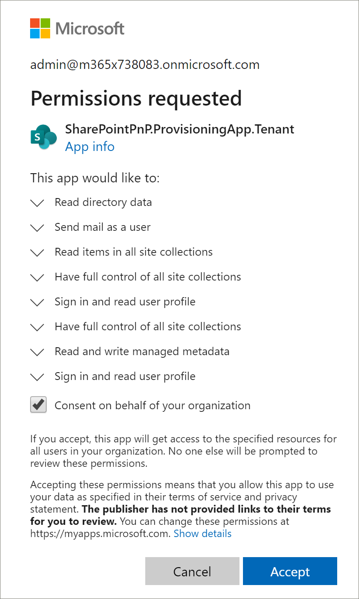

# Microsoft 365 learning の経路をプロビジョニングする

SharePoint Online プロビジョニングサービスを使用すると、Office 365 テナント管理者は、いくつかの簡単なクリックでプロビジョニングプロセスを開始できます。 プロビジョニングサービスは、学習経路をプロビジョニングするために推奨される方法です。 処理を開始するには、短時間で簡単です。 ただし、プロビジョニングサービスを開始する前に、プロビジョニングの前提条件を満たしていることを確認してください。

> [!IMPORTANT]
> 5/21/2019 の間、Microsoft 365 learning の経路は、以前は Office 365 のカスタム学習と呼ばれていたソリューションの新しい名前です。 組織内で Office 365 のカスタム学習機能を既にプロビジョニングしていて、ソリューションを更新する場合は、「 [Microsoft 365 Learning ・パスの ReadMe](https://github.com/pnp/custom-learning-office-365)」の「ソリューションを更新する」の手順に従ってください。 初めて Microsoft 365 learning の経路情報をプロビジョニングする場合は、「microsoft 365 learning の経路」のドキュメントの「 [microsoft 365 learning のラーニングをプロビジョニング]( https://docs.microsoft.com/en-us/office365/customlearning/custom_provision)する」の手順を参照してください。  

## 前提条件
 
プロビジョニングサービスで Microsoft 365 learning の経路を正しく設定するには、プロビジョニングを実行するユーザーが次の前提条件を満たしている必要があります。 
 
- ユーザープロビジョニングの学習経路は、学習経路がプロビジョニングされるテナントのテナント管理者である必要があります。  
- テナントアプリカタログは、SharePoint 管理センターの [アプリ] オプションで使用できる必要があります。 組織に SharePoint テナントのアプリカタログがない場合は、 [Sharepoint Online のドキュメント](https://docs.microsoft.com/en-us/sharepoint/use-app-catalog)を参照して作成します。  
- ユーザープロビジョニングの学習経路は、テナントのアプリカタログのサイトコレクションの所有者である必要があります。 学習経路をプロビジョニングするユーザーがアプリカタログのサイトコレクションの所有者ではない場合は、[次の手順を実行](addappadmin.md)して続行します。 

### 学習経路をプロビジョニングするには

1. にhttp://provisioning.sharepointpnp.com移動して、ホームページの右上隅から**サインイン**します。  サイトテンプレートをインストールする予定の対象となるテナントの資格情報を使用してサインインします。

2. **組織の代わりに同意**をクリアし、[**同意**する] を選択します。

プロビジョニングサービスには、テナントのアプリカタログを作成し、アプリケーションをテナントのアプリカタログにインストールし、サイトテンプレートをプロビジョニングするためのアクセス許可が必要です。 テナントに全体的な影響がありません。これらのアクセス許可は、ソリューションのインストールの目的で明示的に使用されます。 インストールを続行するには、これらのアクセス許可を受け入れる必要があります。

3. ページを下にスクロールし、[**ソリューション**] タブを選択してから、[ **Office 365 の学習経路**] を選択します。 

4. [**テナントに追加**] を選択します。

5. ご使用のインストールに応じて、[プロビジョニング情報] ページのフィールドを入力します。 少なくとも、プロビジョニングプロセスに関する通知を取得する電子メールアドレスと、サイトをプロビジョニングする宛先の URL を入力します。  
> [!NOTE]
> サイトの宛先 URL を、"/sites/MyTraining" や "/teams/LearnMicrosoft365" などの従業員にとってわかりやすいものにします。

6. テナント**** 環境に学習経路をインストールする準備ができたら、[準備] を選択します。  プロビジョニングプロセスには最大15分かかります。 サイトがアクセスできる状態になると、メールによって ([プロビジョニング] ページで入力した通知の電子メールアドレスに) 通知されます。 

> [!IMPORTANT]
> ラーニングポイントサイトをプロビジョニングするテナント管理者は、サイトに移動し、 **CustomLearningAdmin**を開いて学習経路管理プロパティを初期化する必要があります。 この時点で、テナント管理者はサイトに所有者を割り当てる必要があります。 

## プロビジョニングが成功したことを検証し、CustomConfig リストを初期化する

プロビジョニングが完了すると、サイトをプロビジョニングしたテナント管理者が、PnP プロビジョニングサービスから電子メールを受信します。 電子メールには、サイトへのリンクが含まれています。 この時点で、テナント管理者は、電子メールで提供されているリンクを使用してサイトに移動し、最初に使用するサイトを設定する必要があります。

- `<YOUR-SITE-COLLECTION-URL>sites/<YOUR-SITE-NAME>/SitePages/CustomLearningAdmin.aspx` に移動します。 **CustomLearningAdmin**を開くと、最初に使用するための学習経路を設定する**customconfig**リストアイテムが初期化されます。 次のようなページが表示されます。

## サイトに所有者を追加する
テナント管理者は、サイトをカスタマイズするユーザーになる可能性があるので、サイトにいくつかの所有者を割り当てる必要があります。 所有者はサイトの管理権限を持っているため、サイトのページを変更したり、サイトを再ブランド化したりできます。 また、ラーニングパス Web パーツを通じて配信されるコンテンツを非表示にし、表示することもできます。 さらに、カスタムのプレイリストを作成してカスタムサブカテゴリに割り当てることができます。  

1. [SharePoint の**設定**] メニューの [**サイトの権限**] をクリックします。
2. [**高度なアクセス許可の設定**] をクリックします。
3. [ **Microsoft 365 learning の経路の所有者**] をクリックします。
4. [**新しい** > **ユーザーをこのグループに追加する**] をクリックし、所有者にするユーザーを追加します。 
5. 共有メッセージ内の[サイトを探索](custom_exploresite.md)するためのリンクを追加し、[**共有**] をクリックします。

### 次のステップ
- サイトと web パーツで提供される[既定のコンテンツ](custom_exploresite.md)について説明します。
