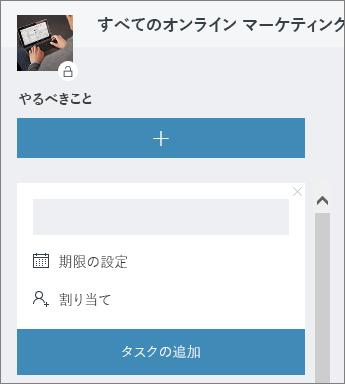

# Office の会議Meeting at the Office

午前 10 時。会議の時間です。It's 10:00 AM and time for your meeting. このセクションでは、会議の生産性を向上させる方法について説明します。In this section, we'll show you how to make your meetings more productive.  これには、会議の準備と Office 365 ツールに関するベスト プラクティスが含まれます。This involves best practices for meeting preparation and Office 365 tools.  

## ツールTools
- OutlookOutlook
- Microsoft TeamsMicrosoft Teams
- Skype for BusinessSkype for Business
- OneNoteOneNote

## 会議のチェックリストChecklist for your meeting
- 会議を計画して予約するPlan and book your meeting
- 会議に参加するJoin a meeting
- 会議で情報を表示するPresent information in a meeting
- 共同作成とメモのために会議で OneNote を使用するUse OneNote in a meeting for co-creation and notes
- 会議で Planner を使用して、そのプロジェクトの実施項目を追跡するUse Planner in a meeting to track action items for that project
- 会議を終了するEnd a meeting
 
## 会議を計画して予約するPlan and book your meeting
次のポイントを踏まえることで、会議の生産性を高めることができます。There are a few things you can do to ensure your meeting is as productive as possible:

1. **会議が必要な場合****Do you need a meeting?** まず、必要な承認者とチャットでファイルを共有することを検討します。Consider sharing a file in chat with the necessary approvers first.  
1. **議題を明確にする。****Have a clear agenda.**  出席者が準備できるように、オンライン会議出席依頼の [メモ] セクションに会議の議題を含めます。Include your meeting agenda in the notes section of your online meeting invitation so attendees can be prepared.
1. **会議を記録する。** 会議に出席できなかった人と会議を共有したり、後でメモを転記したりするために、Microsoft Teams の会議記録機能を使用します。**Record your meeting**  Use meeting recording functions in Microsoft Teams to share the meeting with people who could not attend or to transcribe notes later.  

これで、会議の予約をする準備ができました。Outlook で Microsoft Teams や Skype for Business の [詳細] を使用して、会議を予約します。Now you're ready to book that meeting:  Book the meeting with Microsoft Teams or Skype for Business details in Outlook. そうすることにより、さまざまな場所のチーム メンバーを含めることができ、会議を記録し、ビデオを活用して (可能な場合)、コミュニケーションを促進できます。Doing so enables you to include team members from different locations, record the meeting and utilize video (when available) to enhance communication. 

## 会議に参加するJoin a meeting
どこからでも参加できます。Join from anywhere. Microsoft Teams や Skype for Business の会議には、モバイル デバイスを使って [会議の詳細] にあるダイヤルイン番号に電話するかモバイル アプリを使用することにより、どこからでも参加できます。It is possible to join a Microsoft Teams or Skype for Business meeting from anywhere using a mobile device, either by calling the dial-in number in the meeting details or using the mobile apps. モバイル アプリを使用する場合は、お客様またはお住まいの国に適用されるモバイル データ使用量の制限にご注意ください。When using the mobile apps, be conscious of mobile data usage limits that apply to you or your country.

> [!TIP]
> **ヘッドセットを使用する。****Use a headset.** デスクのコンピューターから接続している場合は、コンピューターの内臓マイクやスピーカーを使う代わりにヘッドセットを使用すると、通話品質を改善できます。If you are connecting from your computer at your desk, use a headset rather than your computer's built-in microphone and speakers to ensure a better call quality.

> [!TIP]
> ビデオをオンにする。Turn on your video! カメラを使用できる場合は、カメラを使用しましょう。対面式のコミュニケーションでは、音声のみでは伝えきれない言葉以外のニュアンスを伝えることができます。When cameras are available, it's worth using them, as face-to-face communication provides non-verbal cues that can be missed when just using voice. 大丈夫。髪型も素敵ですよ。Don't worry, your hair looks great. 

## 会議で情報を表示するPresent information in a meeting
デバイスのコンテンツを共有することは、会議に集中させ、ディスカッションのコンテキストを提供する優れた方法の 1 つです。Sharing content from your device is a great way to focus your meeting and provide context to the discussion. 一般的には、使用している画面全体を共有するのはよい方法とは言えません。In general, sharing your entire screen can be a bad idea. そのようにすると、自分の画面に表示されるものはすべて、会議に出席している他のユーザー全員の画面にも表示されてしまいます。It means that everything that comes up on your screen will appear on the screens of everyone attending the meeting. これは、Microsoft Teams で共有するコンテンツを選択するだけで避けることができます。Avoid this by simply selecting the content you want to share in Microsoft Teams. 

## 会議で OneNote を使用するUse OneNote in a meeting
OneNote は、リアルタイムのコラボレーションや共同作成を行えるので、会議でブレーンストーミングやメモ取りを行うのに最適なツールです。OneNote can allow for real-time collaboration and co-creation, making it an ideal tool for brainstorming and note taking in meetings. OneNote が共有されている場所にすべてのユーザーがアクセスできさえすれば、そのノートブックのリンクを投稿するだけで、すぐにブレーンストーミングを始めることができます。As long as everyone has access to the location where the OneNote is shared, you can post a link to the notebook and start brainstorming right away.

チーム ノートブックには、会議のメモ用に特定のセクションを作成できます。You can create a specific section for meeting notes in the team notebook. OneNote の "会議の詳細" 機能を使用して、会議の詳細をまとめたページを作成することもできます。You can also use the "meeting details" functionality in OneNote to create pages with a summary of the details of the meeting.

## 会議で Planner を使用するUse Planner in a meeting
プロジェクトのプランに実施項目を直接追加することで、事後にそれらを転記する手間を省くことができます。Directly adding action items into a plan for your project saves you from transcribing them after the fact. 大規模なプロジェクト会議では、実施項目の追跡とメモ取りに誰かを割り当てておくことが最善です。It's a best practice in large project meetings to assign someone to action tracking & note taking. 通常は、会議を進行している人物とは異なる人物を割り当てます。This is normally a different person than the individual running the meeting. 実施項目の期限が過ぎると、その実施項目が割り当てられている人物にリマインダーが直接送信されます。Action item reminders are sent directly to the individual to whom it is assigned as are reminders if the item passes it's due date. 

## 会議を終了するEnd a meeting
議題の議論がすべて済んだら、時間に関係なく会議を終了します。When everything on the agenda has been discussed, end the meeting, regardless of the time. すべての参加者に実施項目を割り当てて、送信します。Assign and send action items to all participants. Microsoft Teams で共同作業を行っている場合は、適切なチャネルで実施項目を簡単に共有できます。If you are collaborating in Microsoft Teams, you can easily share action items in the appropriate channel. 実施項目は、会議中に Planner で入力して割り当てることもできます。このようにすれば、完了をすばやく追跡でき、[Microsoft Teams でアクセスすることもできます](https://support.office.com/ja-JP/article/use-planner-in-microsoft-teams-62798a9f-e8f7-4722-a700-27dd28a06ee0)。Action items can also be entered and assigned in Planner during the meeting, providing a fast way to track for completion which can also be [accessed in Microsoft Teams](https://support.office.com/ja-JP/article/use-planner-in-microsoft-teams-62798a9f-e8f7-4722-a700-27dd28a06ee0). 